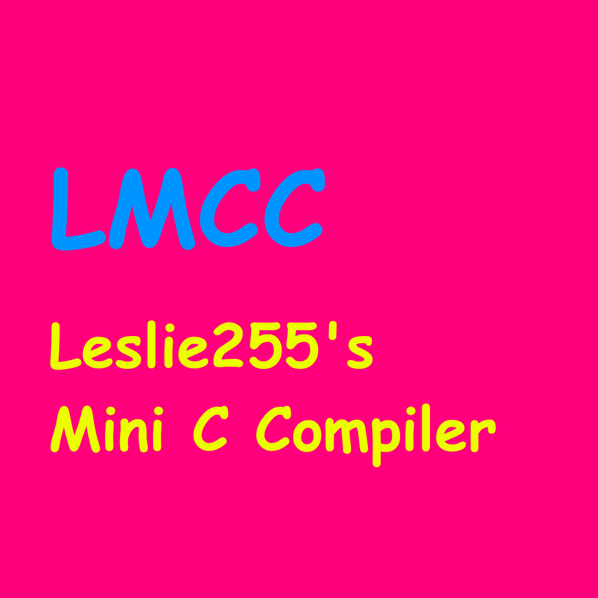

# LMCC: Leslie's Mini C Compiler

**A mini compiler for C99**

Very WIP.

## Progress

Parser TODO:
- Preprocessor/macros.
- List decl.
- Function pointer types.
- `sizeof` operator.

- Better error recovery.
